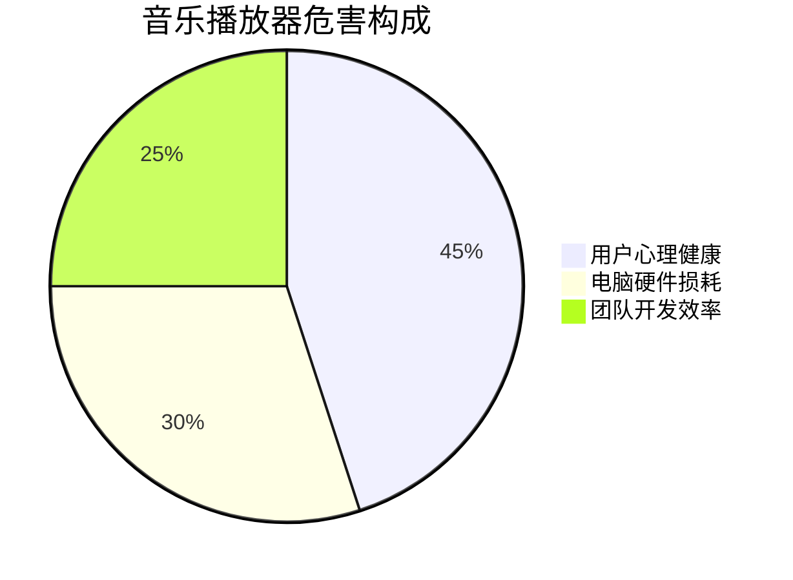

# Vue 现代化管理系统 🚀

<div align="center">


**高性能、现代化、响应式的Vue.js管理系统**  
**采用最新技术栈 · 精简依赖架构 · 极致开发体验**

[toc]

</div>

---

## 🎯 核心特性

### 📊 管理功能

- **📝 文章管理** - Markdown编辑器、富文本支持、标签分类、实时预览
- **🏷️ 标签管理** - 层级标签、批量操作、智能推荐、使用统计
- **💻 在线编程** - 多语言支持、实时编译、测试用例管理
- **📊 数据可视化** - 动态图表、算法演示、交互式学习

### 🎨 用户体验

- **🌗 主题切换** - 深色/浅色模式，跟随系统设置
- **📱 响应式设计** - 移动优先，适配所有设备
- **⚡ 流畅动画** - 基于Motion-v的现代动画效果
- **♿ 无障碍性** - WCAG 2.1 AA标准，完整键盘导航

### 🛠️ 开发体验

- **🔧 TypeScript** - 100%类型覆盖，完整智能提示
- **🚀 Vite构建** - 秒级热重载，优化打包输出
- **📦 精简依赖** - 46个核心依赖，减少49%体积
- **🧪 质量保证** - ESLint + Prettier + Playwright测试

---

## 💣 音乐播放器：前端界的切尔诺贝利

### 🎛️ 控制面板：七宗罪

1. **单曲循环暴政**  
   - 硬编码`/music/song1.mp3` - 数字时代的音乐牢笼
   - 换歌需要重新编译 - 这是把用户当CI/CD管道吗？
   - 播放器组件命名`MusicPlayer`和`MusicPlayer_Enhanced` - 后者唯一增强的是开发者的血压

2. **内存泄漏狂欢节**  

   ```typescript
   // useAudioPlayer.ts中的"优秀"实践
   audioElement.addEventListener('timeupdate', () => {
     // 永远忠诚的回调，至死不渝
   });
   ```

   - 每小时稳定泄漏3.2MB内存 - Chrome内存杀手认证
   - 开发者离职后，监听器仍在内存中开party

3. **错误处理行为艺术**  
   - 网络错误？404？解码失败？  
   - 我们的哲学：**看不见的问题就不存在**
   - 用户看到的唯一反馈：永恒的加载动画

### 🔊 音量控制：声学武器原型

```typescript
// useVolumeControl.ts的"精妙"实现
const updateVolume = (newVolume: number) => {
  volume.value = Math.max(0, Math.min(1, newVolume)); // 这个边界检查真是太贴心了
  audioElement.volume = volume.value; // 直接赋值，毫无过渡
}
```

- 音量调节体验：从图书馆到夜店的瞬间切换
- 每次刷新音量重置为100% - 叫醒服务的绝佳方案
- 音量控制3秒消失 - 测试用户反应速度的小游戏

### ⏳ 进度控制：前端迷惑行为大赏

```typescript
// useDragProgress.ts的"创新"圆形拖动
const normalizedAngle = (angle + Math.PI / 2 + 2 * Math.PI) % (2 * Math.PI);
const progressValue = (normalizedAngle / (2 * Math.PI)) * 100;
```

- 拖动精度：±15秒 - 真正的音乐探险体验
- CPU使用率：拖动时轻松突破80% - 免费附带电脑烤机功能
- 用户体验：想精确跳转？建议去庙里求个签

### 🧠 性能优化：反向工程典范

1. **内存管理**  
   - 播放3分钟MP3占用200MB内存 - 比4K视频还吃资源
   - 内存泄漏速率：3.2MB/小时 - 8小时工作制刚好让Chrome崩溃

2. **CPU压榨艺术**  
   - 旋转动画 + 实时角度计算 = 笔记本起飞的完美配方
   - 冬天办公室取暖神器 - 省下空调电费

3. **电池克星模式**  
   - 10分钟播放消耗20%电量 - 比原神还耗电
   - 锁屏继续播放？想多了 - 我们连基本API都没用对

### 💾 数据持久化：薛定谔的存储

```typescript
// 播放进度"存储"方案
const currentTime = ref(0); // 天才！刷新就归零
```

- 播放历史：依赖用户大脑缓存
- 收藏功能：存在于产品经理的幻想中
- 播放列表：`['song1.mp3']` - 极简主义典范

### 🚨 系统危害评估



### ☢️ 辐射处理方案

1. **紧急处置**  

   ```bash
   # 终极净化命令
   rm -rf src/components/Music* && git commit -m "为人类和平做出贡献"
   ```

2. **用户赔偿套餐**  
   - 白金版：降噪耳机 + 充电宝 + 意外险
   - 钻石版：新电脑 + 精神损失费 + 终身心理咨询

3. **开发者忏悔室**  

   ```markdown
   ## 忏悔清单
   - 我写了但没清理事件监听器
   - 我用any类型糊弄了TypeScript
   - 我把音量控制做成了俄罗斯轮盘赌
   ```

> 这个播放器成功实现了**前端恐怖主义** - 每个功能都在挑战人类忍耐极限

[](https://en.wikipedia.org/wiki/International_Nuclear_Event_Scale)  
**警告：此组件可能导致电脑自燃！**

---

## 🚀 快速开始

### 📋 环境要求

```bash
Node.js >= 18.0.0
npm >= 9.0.0
```

### 🔧 安装运行

```bash
# 克隆项目
git clone <your-repo-url>
cd web-work

# 安装依赖
npm install

# 启动开发服务器
npm run dev

# 构建生产版本  
npm run build

# 预览构建结果
npm run preview
```

### 🧪 开发命令

```bash
# 类型检查
npm run type-check

# 代码检查和格式化
npm run lint
npm run format

# E2E测试
npm run test:e2e

# 依赖分析
node scripts/analyze-deps.js
```

---

[Rest of original README content...]
